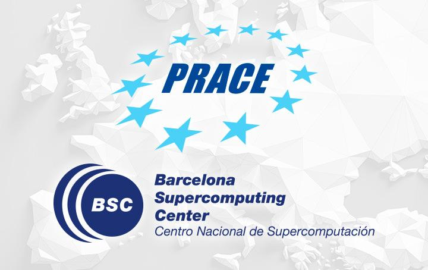

# PATC: Introduction to Big Data Analytics @ BSC

  

## Table of Contents
1. [Description](#description)
2. [Information](#information)
3. [File descriptions](#files)
4. [Certificate](#certificate)

## Description

The objective of this course was to introduce the main concepts and technologies related to Big Data and Data Analytics and its applications to real projects.
The course brought together key information technologies used in manipulating, storing, and analysing data.

Students were introduced to systems that can accept, store, and analyse large volumes of unstructured data. The learned skills can be used in data intensive application areas.

## Information

The overall goals of this course were the following:
> - Introduction to storage and process unstructured data. Main concepts of NoSQL databases;
> - Large scale processing: Apache Spark and its core libraries for data manipulation, machine learning, data streams and graph analytics;
> - Characterization of a data mining problem and its relation with business intelligence, dig data and exploratory statistics;
> - Basics of Python deep learning technics with TensorFlow;
> - Basic concepts of data visualization and tools.

More detailed information and links for the course can be found on the [course website](https://events.prace-ri.eu/event/1472/).

## File descriptions

The exercises and assessments can be found in this repository and are organized in their respective folders, one for each day of the course:
- [Day 1 - Introduction to Big Data, Practical Data Analytics for Solving Real World Problems, Hands-on (How to structure a data analytics project);](https://github.com/HROlive/PATC-Big-Data-Analytics-BSC/tree/main/Day%201)
- [Day 2 - Big Data Management, NoSQL databases, Multidisciplinary research and data analytics: Cultural Heritage;]()
- [Day 3 - Data Analytics with Apache Spark, Hifi-Turb: high-fidelity les/dns data for innovative turbulence models (A H2020 European Project);]()
- [Day 4 - Bias in Science (Sex and Gender Perspective in Big Data Analytics), Business Intelligence, Data analytics, modelling and simulation for solving city challenges (Use case: achieving clean air in Barcelona);]()
- [Day 5 - Data Visualization Theory;]()

## Certificate

The certificate for the course can be found bellow:

["" - ]() (Issued On: February 2023)
